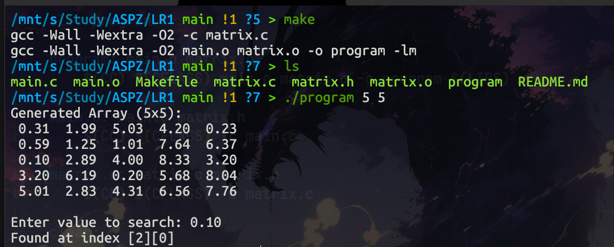

Цей проект демонструє принципи побудови системного програмного забезпечення на мові C. Програма реалізує генерацію та пошук у динамічному масиві, використовуючи модульний підхід, роздільну компіляцію та автоматизацію збірки.

## Структура проекту
Програма розділена на логічні модулі для дотримання принципу **Single Responsibility** (єдина відповідальність):

- **`main.c`** — Точка входу. Відповідає за обробку аргументів командного рядка (`argc`, `argv`) та взаємодію з користувачем.
- **`matrix.c`** — Реалізація бізнес-логіки. Містить функції для безпечної роботи з пам'яттю та алгоритми обробки даних.
- **`matrix.h`** — Інтерфейс модуля. Описує доступні функції, приховуючи деталі реалізації від основного модуля.
- **`Makefile`** — Скрипт автоматизації збірки. Керує залежностями, компіляцією об'єктних файлів та лінковкою (включаючи бібліотеку `libm`).

## Архітектурні особливості
Проект розроблено з урахуванням вимог до системного ПЗ:

1.  **Модульність:** Код розділено на інтерфейс (`.h`) та реалізацію (`.c`), що дозволяє незалежно компілювати модулі.
2.  **Управління пам'яттю:** Використовується динамічне виділення пам'яті (`malloc`/`free`) для роботи з великими обсягами даних, що не вміщуються у стер (stack).
3.  **Системні виклики та бібліотеки:**
    - Використання стандартної бібліотеки C (`libc`).
    - Лінковка з математичною бібліотекою (`libm`) для функції `fabs`.
4.  **Автоматизація (Build System):** Використання `make` для відстеження змін у файлах та оптимізації процесу перекомпіляції.

## Компіляція та запуск

Для збірки проекту використовується утиліта **Make**.

### 1. Збірка проекту
У терміналі виконайте команду:
```bash
make```

