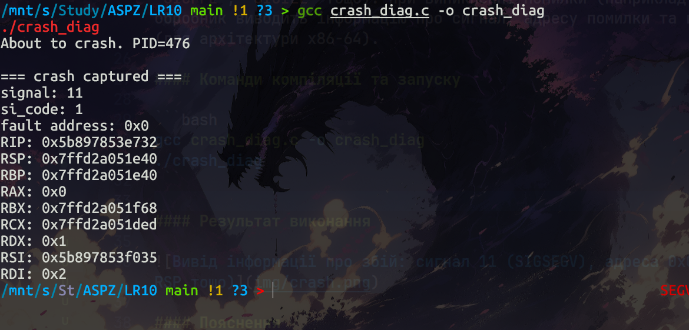
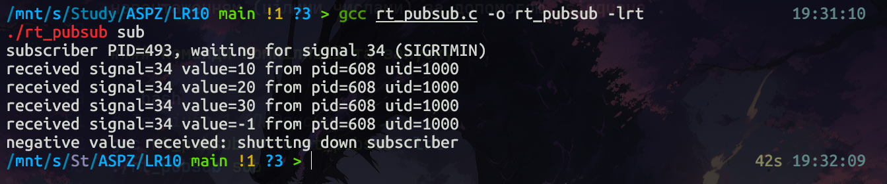
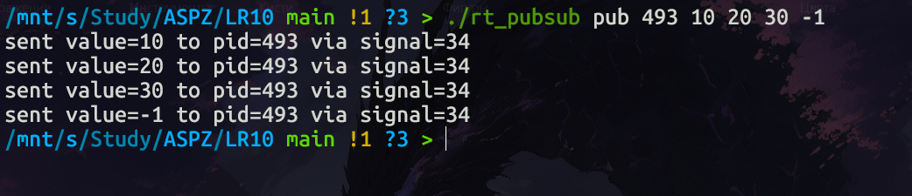
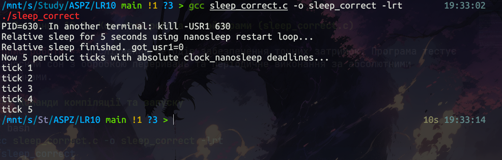
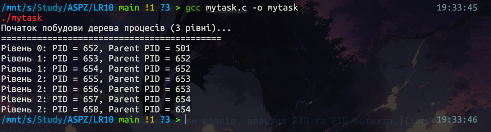

# Практична робота №10: Обробка сигналів та керування часом у POSIX-сумісних ОС

---

## Теоретичні відомості

У системному програмуванні для UNIX/POSIX систем сигнали та механізми керування часом є критично важливими для створення надійних та реального часу (real-time) додатків.

### Сигнали
Сигнали — це програмні переривання. Основні аспекти:
- **`sigaction()`** — сучасний інтерфейс для встановлення обробників сигналів, що дозволяє отримувати детальну інформацію через `siginfo_t`.
- **Реального часу сигнали (`SIGRTMIN` – `SIGRTMAX`)** — на відміну від стандартних сигналів, вони можуть ставитися в чергу (не втрачаються) та переносити цілочисельне значення або вказівник через `sigqueue()`.
- **`sigwaitinfo()` / `sigtimedwait()`** — дозволяють синхронно очікувати на надходження сигналів, що часто є безпечнішим за асинхронні обробники.

### Керування часом
- **`nanosleep()`** — забезпечує високу точність затримки. Важливо обробляти випадок переривання сигналом (`EINTR`) через перезапуск із залишком часу (`rem`).
- **`clock_nanosleep()`** — дозволяє використовувати абсолютні дедлайни (`TIMER_ABSTIME`), що запобігає накопиченню похибки в періодичних завданнях.

---

## Загальні завдання

### Завдання 10.1: Діагностика збоїв (crash_diag.c)

**Опис роботи:** Програма встановлює обробники для критичних сигналів (`SIGSEGV`, `SIGFPE`, `SIGILL` тощо). При виникненні помилки (наприклад, розіменування `NULL`), обробник виводить інформацію про сигнал, адресу помилки та вміст регістрів процесора (для архітектури x86-64).

#### Команди компіляції та запуску

```bash
gcc crash_diag.c -o crash_diag
./crash_diag
```

#### Результат виконання



#### Пояснення

Використання `SA_SIGINFO` у `sigaction` дозволяє отримати доступ до `ucontext_t`, який містить стан процесора в момент збою. Це дозволяє створювати "посмертні" дампи безпосередньо в програмі для полегшення налагодження.

---

### Завдання 10.2: Модель "Публікація-Підписка" на базі RT-сигналів (rt_pubsub.c)

**Опис роботи:** Реалізація механізму передачі повідомлень між процесами. Один процес (підписник) чекає на сигнали, а інший (видавець) надсилає сигнали з корисним навантаженням (цілими числами) за допомогою `sigqueue`.

#### Команди компіляції та запуску

```bash
# Термінал 1 (Підписник)
gcc rt_pubsub.c -o rt_pubsub -lrt
./rt_pubsub sub

# Термінал 2 (Видавець)
./rt_pubsub pub <PID_підписника> 10 20 30 -1
```

#### Результат виконання




#### Пояснення

Програма демонструє переваги реального часу сигналів: можливість передачі даних (`si_value`) та гарантована черга повідомлень. Підписник використовує `sigwaitinfo` для синхронного отримання сигналів без ризику виникнення станів гонитви (race conditions).

---

### Завдання 10.3: Коректна робота з таймерами (sleep_correct.c)

**Опис роботи:** Дослідження методів забезпечення точних затримок. Програма тестує відносний сон з обробкою переривань та періодичне виконання за абсолютними дедлайнами.

#### Команди компіляції та запуску

```bash
gcc sleep_correct.c -o sleep_correct -lrt
./sleep_correct
```

#### Результат виконання



#### Пояснення

Функція `sleep_relative_ms` демонструє правильний паттерн використання `nanosleep`: якщо сон перервано сигналом, ми викликаємо його знову для залишку часу. Друга частина програми використовує `CLOCK_MONOTONIC` та `clock_nanosleep`, що є стандартом для real-time систем, оскільки це захищає від стрибків системного часу.

---

## Варіант №8

### Завдання: Побудова дерева процесів (3 рівні, 2 дочірні на кожен)

**Опис роботи:** Програма рекурсивно створює ієрархію процесів. Кожен процес на 0-му та 1-му рівнях створює по 2 дочірні процеси. Разом із батьківським процесом утворюється дерево з 7 процесів (1 + 2 + 4).

#### Команди компіляції та запуску

```bash
gcc mytask.c -o mytask
./mytask
```

#### Результат виконання



#### Пояснення

Використання `fork()` у циклі та рекурсивний виклик функції `create_process_tree` дозволяють побудувати чітку структуру. Кожен батьківський процес очікує на завершення своїх дітей через `wait(NULL)`, що запобігає появі процесів-зомбі та забезпечує цілісність виводу.

---

## Висновок

У ході роботи було вивчено розширені можливості роботи з процесами та сигналами в ОС Linux/POSIX:
- Реалізація обробників критичних помилок.
- Використання черг реального часу сигналів для передачі даних.
- Забезпечення стабільних затримок у багатозадачному середовищі.
- Побудова складних ієрархій процесів.

Ці навички є базовими для розробки високонадійного та системного програмного забезпечення.
