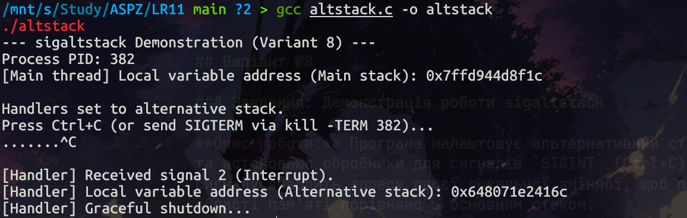

# Практична робота №11: Використання альтернативного стеку сигналів

---

## Теоретичні відомості

У системах UNIX/Linux кожен процес має основний стек, який використовується для виклику функцій та зберігання локальних змінних. Однак, у деяких випадках (наприклад, при переповненні стеку), обробка сигналів на основному стеку стає неможливою.

Для вирішення цієї проблеми використовується механізм **альтернативного стеку сигналів** (`sigaltstack`). Він дозволяє призначити окрему область пам'яті (зазвичай у купі) для виконання обробників сигналів.

Основні компоненти:
- **`sigaltstack()`**: Системний виклик для реєстрації альтернативного стеку.
- **`stack_t`**: Структура, що описує стек (адреса початку `ss_sp`, розмір `ss_size` та прапорці `ss_flags`).
- **`SA_ONSTACK`**: Прапорець у структурі `sigaction`, який вказує системі, що конкретний сигнал має оброблятися на альтернативному стеку.

Це критично важливо для діагностики критичних помилок (наприклад, `SIGSEGV` через переповнення стеку), коли програма не може продовжувати роботу на основному стеку.

---

## Варіант №8

### Завдання: Демонстрація роботи sigaltstack

**Опис роботи:** Програма налаштовує альтернативний стек за допомогою `sigaltstack` та встановлює обробники для сигналів `SIGINT` (Ctrl+C) та `SIGTERM`. Обробник сигналу виводить адресу своєї локальної змінної, щоб підтвердити використання іншої області пам'яті порівняно з основним стеком.

#### Команди компіляції та запуску

```bash
gcc altstack.c -o altstack
./altstack
```

#### Результат виконання



#### Пояснення

У головній функції `main` ми виділяємо пам'ять для стеку за допомогою `malloc` та реєструємо її в системі. При налаштуванні `sigaction` ми обов'язково вказуємо прапорець `SA_ONSTACK`. 

Під час отримання сигналу, ОС перемикає контекст на наш альтернативний стек. Порівняння адрес локальних змінних у `main` та `signal_handler` показує значну різницю, що підтверджує: обробник працює у виділеній нами області пам'яті (heap), а не на стандартному системному стеку.
