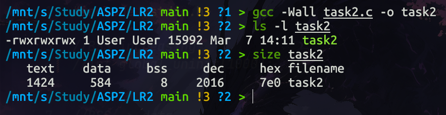
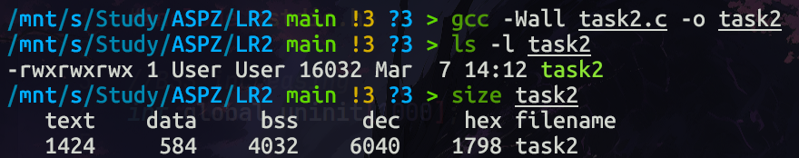
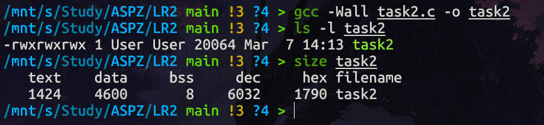
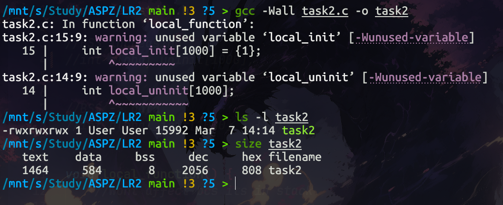
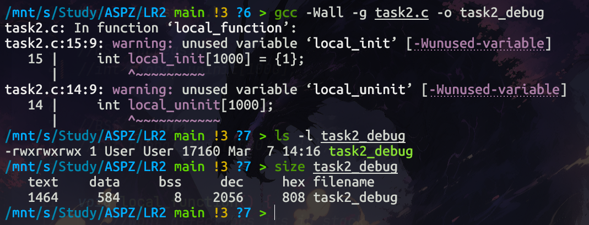
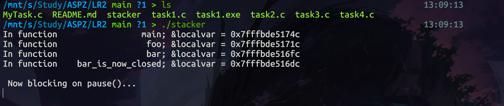
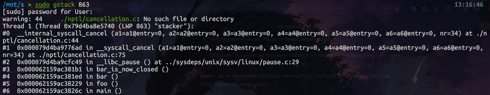
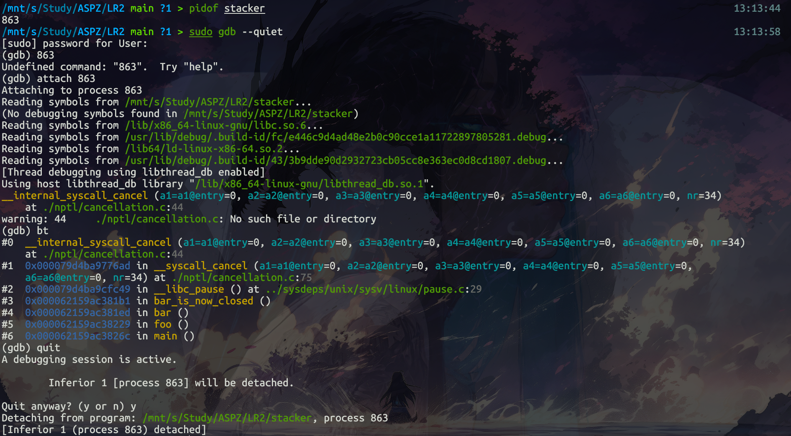
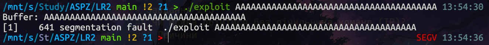

# Практичне заняття №2

## Дослідження сегментів пам'яті та структури виконуваних файлів

------------------------------------------------------------------------

# 1. Теоретична довідка (огляд сегментів)

Виконувані файли в Linux (формат **ELF**) поділяються на кілька
сегментів пам'яті.

### Основні сегменти

-   **Text (текстовий сегмент)**\
    Містить машинний код програми (інструкції процесора).

-   **Data (сегмент даних)**\
    Зберігає глобальні та статичні змінні, які **ініціалізовані
    програмістом**.\
    Ці дані займають фізичне місце у виконуваному файлі.

-   **BSS**\
    Містить **неініціалізовані глобальні та статичні змінні**.\
    Вони **не займають місця у виконуваному файлі**, щоб зменшити його
    розмір.\
    Під час запуску програми операційна система автоматично ініціалізує
    їх нулями.

-   **Stack (стек)**\
    Використовується для:

    -   локальних змінних функцій
    -   збереження адрес повернення
    -   параметрів функцій

-   **Heap (купа)**\
    Використовується для **динамічного виділення пам'яті** (`malloc`,
    `new` тощо).

> Стек і купа створюються лише **під час виконання процесу в оперативній
> пам'яті**.

------------------------------------------------------------------------

# 2. Загальні завдання

------------------------------------------------------------------------

# Завдання 1

## Визначення переповнення `time_t`

Було досліджено розмір змінної `time_t`.

-   На **32-бітних системах** `time_t` займає **4 байти**.
-   Це призводить до **переповнення у 2038 році** (так звана *проблема
    2038 року*).

Перехід на **64-бітні системи** вирішує проблему:

-   `time_t` займає **8 байтів**
-   переповнення стає практично неможливим у доступному майбутньому.

------------------------------------------------------------------------

# Завдання 2.2

## Розміри сегментів та виконуваного файлу

За допомогою утиліт:

-   `size`
-   `ls -l`



було встановлено наступне:

### 1. Неініціалізований глобальний масив

-   збільшує значення **BSS** у `size`
-   **не змінює розмір файлу** на диску (`ls -l`)



### 2. Ініціалізований глобальний масив

-   розміщується у **сегменті Data**
-   **збільшує розмір виконуваного файлу**, оскільки дані записуються в
    ELF


### 3. Локальні масиви

-   зберігаються **у стеку**
-   **не впливають** на сегменти `text`, `data`, `bss`



### 4. Прапорці компіляції

При використанні **debug-прапорців**:

-   розмір файлу **значно збільшується**
-   через **символи налагодження**

При цьому розміри сегментів:

-   `text`
-   `data`
-   `bss`

**не змінюються**.



------------------------------------------------------------------------

# Завдання 2.3

## Розташування стека

Аналіз адрес змінних показав:

-   **Stack** знаходиться у **верхній частині адресного простору**
-   стек **зростає вниз** (до менших адрес)

Приблизне розташування сегментів:

    Високі адреси
    ↓
    Stack
    ↓
    Heap
    ↓
    BSS
    ↓
    Data
    ↓
    Text
    Низькі адреси

------------------------------------------------------------------------

# Завдання 2.4

## Дослідження стека процесу (GDB / gstack)

Було досліджено стек процесу за допомогою:

-   `gstack`
-   `gdb`

Для цього використовується програма **task4.c**, яка виконує вкладені
виклики:

    main()
     → foo()
       → bar()
         → bar_is_now_closed()
           → pause()

Системний виклик **`pause()`** блокує виконання процесу та переводить
його у режим очікування сигналу.\
Це дозволяє **зупинити програму** та дослідити її стек.

------------------------------------------------------------------------

## Крок 1. Компіляція та запуск

``` bash
gcc -Wall task4.c -o task4
./task4
```

Програма виводить адреси локальних змінних і переходить у режим
очікування.



------------------------------------------------------------------------

## Крок 2. Аналіз за допомогою `gstack`

Дізнавшись **PID процесу**, можна переглянути стек:

``` bash
gstack <PID_ПРОЦЕСУ>
```

В Ubuntu замість `gstack` можна використовувати:

    pstack



### Аналіз стеку

-   номер кадру відображається перед символом `#`
-   стек читається **знизу вверх**
-   **#0** --- поточна функція виконання (`pause()`)

------------------------------------------------------------------------

## Крок 3. Аналіз за допомогою GDB

До процесу можна підключитися вручну.

``` bash
sudo gdb --quiet
```

Після запуску:

``` bash
(gdb) attach <PID_ПРОЦЕСУ>
(gdb) bt
```

Команда **`bt` (backtrace)** виводить стек викликів.



------------------------------------------------------------------------

## Висновок до завдання 2.4

Результати `gstack` і `gdb` **ідентичні**, тому що:

> `gstack` --- це оболонковий скрипт, який всередині викликає **GDB** і
> виконує команду `backtrace`.

------------------------------------------------------------------------

# Завдання 2.5
## Чи можна обійтися без лічильника команд (IP)?

Під час виклику функцій процесор активно використовує стек. 
У стек зберігається адреса повернення — тобто місце у програмі, 
куди потрібно повернутися після завершення функції.

Проте стек **не може повністю замінити лічильник команд (Instruction Pointer, IP)**.

### Причини

1. **IP визначає поточну інструкцію**
   
   Регістр IP (у x86 — RIP/EIP) постійно містить адресу **наступної машинної інструкції**, 
   яку має виконати процесор.

2. **Стек використовується лише при виклику функцій**

   Коли виконується інструкція `call`, процесор:

   - зберігає адресу повернення у стек
   - переходить до нової функції

   При `ret` адреса витягується зі стеку і записується в IP.

# Завдання за варіантом №8
## Демонстрація переповнення буфера

Переповнення буфера (buffer overflow) виникає тоді, коли програма записує
дані за межі виділеного масиву.

Це може призвести до:

- пошкодження локальних змінних
- зміни адреси повернення
- виконання довільного коду

### Вразлива програма

```c
void vulnerable(char *input) {
    char buffer[16];
    strcpy(buffer, input);
}
```

### Демонстрація програми
```bash
gcc -fno-stack-protector -z execstack -g exploit.c -o exploit
```

