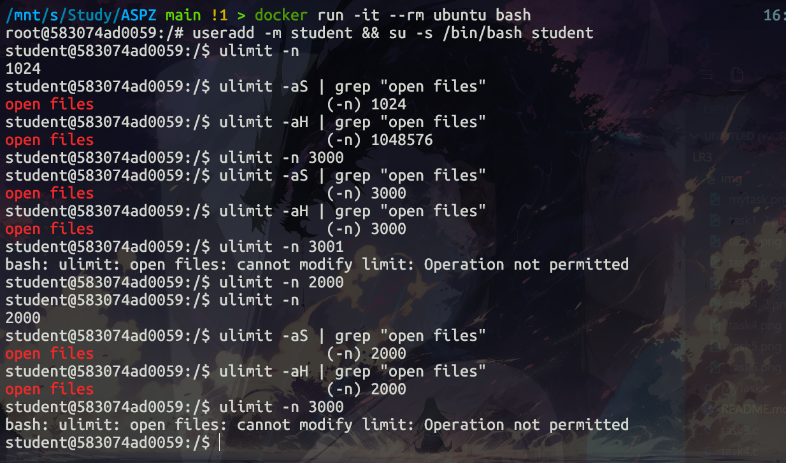
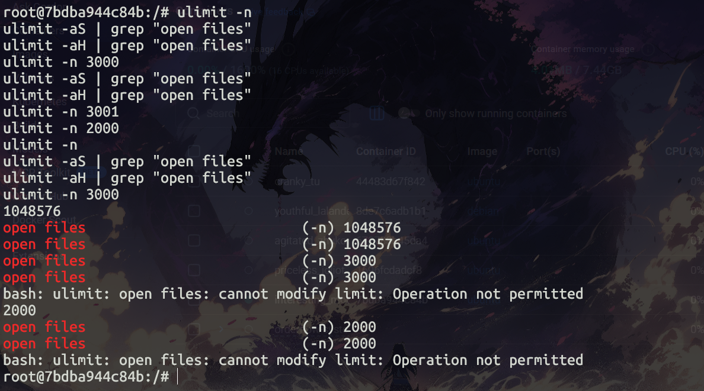
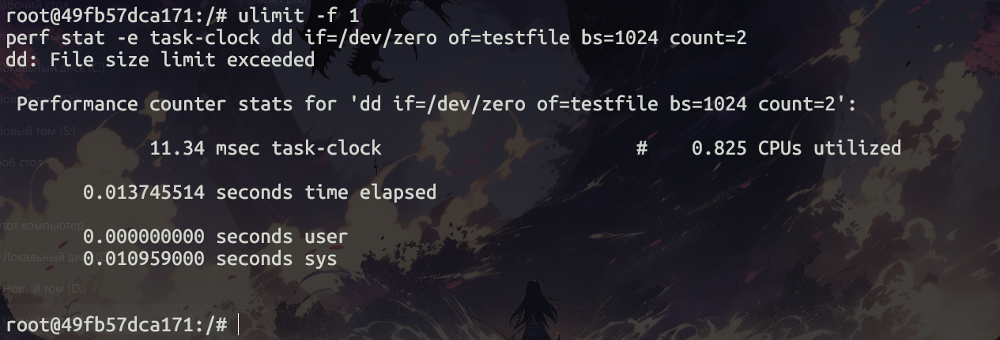
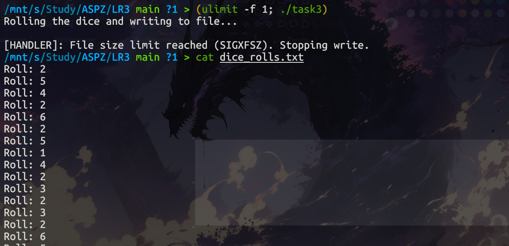
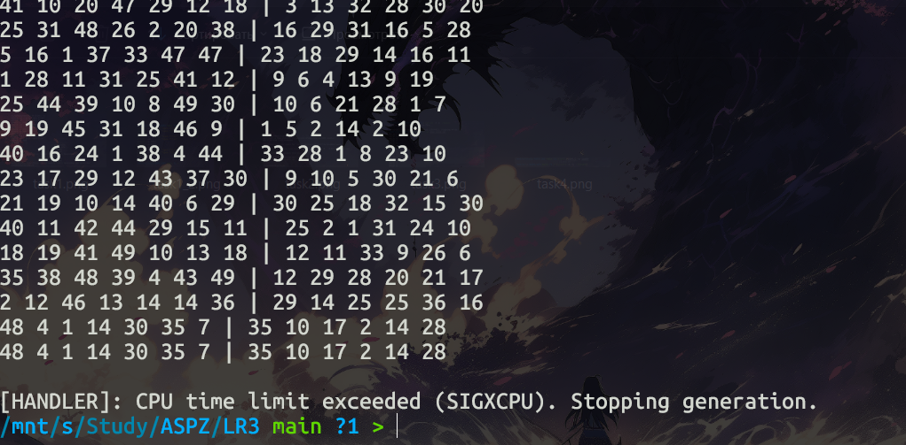
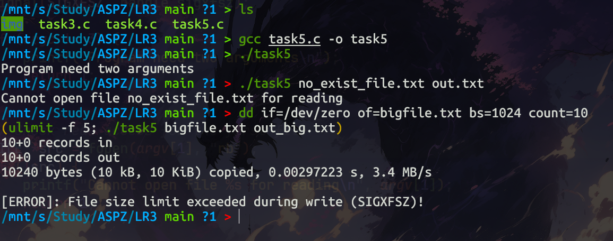
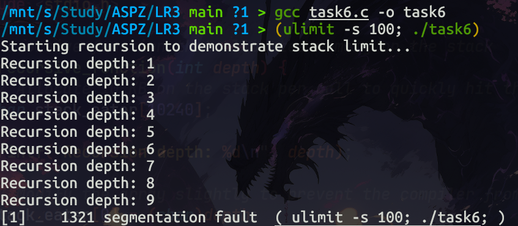
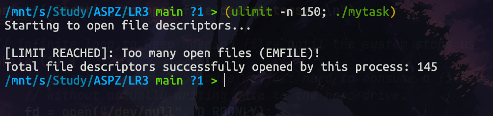

# Практична робота 3

## Дослідження обмежень ресурсів у середовищі Docker

------------------------------------------------------------------------

# Завдання (загальні для всіх)

## Завдання 3.1 --- Дослідження ліміту відкритих файлів

### Умова

Необхідно дослідити обмеження на максимальну кількість відкритих файлів
для процесу за допомогою команди `ulimit`.

### Рішення

Було запущено Docker-контейнер на базі Ubuntu та виконано експерименти
зі зміною лімітів відкритих файлів.

У Linux існує два типи лімітів:

-   **Soft limit** --- поточний ліміт, який може змінювати користувач
-   **Hard limit** --- максимальний ліміт, який може бути встановлений

Звичайний користувач може **зменшувати ліміт**, але не може встановити
значення більше за hard limit. Користувач **root** має можливість
змінювати обидва ліміти.

### Команди

``` bash
docker run -it --rm ubuntu bash
useradd -m student && su -s /bin/bash student
ulimit -n
ulimit -aS | grep "open files"
ulimit -aH | grep "open files"
ulimit -n 3000
ulimit -aS | grep "open files"
ulimit -aH | grep "open files"
ulimit -n 3001
ulimit -n 2000
ulimit -n
ulimit -aS | grep "open files"
ulimit -aH | grep "open files"
ulimit -n 3000
```
### User


### Root User

------------------------------------------------------------------------

# Завдання 3.2 --- Використання утиліти perf

### Умова

Необхідно встановити утиліту `perf` у контейнері Docker та дослідити
роботу процесу при досягненні встановлених лімітів.

### Рішення

Було використано контейнер Debian та встановлено пакет `linux-perf`. Для
демонстрації роботи утиліти встановлено обмеження на максимальний розмір
файлу (`ulimit -f`). Після досягнення цього ліміту процес завершувався.

### Команди

``` bash
docker run -it --privileged --rm debian bash

apt update
apt install -y linux-perf

ulimit -f 1

perf stat -e task-clock dd if=/dev/zero of=testfile bs=1024 count=2
```

------------------------------------------------------------------------

# Завдання 3.3 --- Імітація кидання кубика

### Умова

Необхідно створити програму, що імітує кидання шестигранного кубика.
Результати кидків повинні записуватися у файл з обмеженням на
максимальний розмір.

### Рішення

Було реалізовано програму мовою **C**, яка генерує випадкові числа від
**1 до 6** та записує їх у файл.

Перед запуском програми встановлюється обмеження на розмір файлу за
допомогою:

    ulimit -f

Коли файл перевищує встановлений розмір, система надсилає процесу сигнал
**SIGXFSZ**, що призводить до завершення програми.

### Команди

``` bash
gcc task3.c -o task3

(ulimit -f 1; ./task3)
```


------------------------------------------------------------------------

# Завдання 3.4 --- Імітація лотереї

### Умова

Необхідно створити програму, яка:

-   генерує **7 чисел з діапазону 1--49**
-   генерує **6 чисел з діапазону 1--36**

Також потрібно встановити обмеження на **CPU time**.

### Рішення

Програма генерує випадкові числа у нескінченному циклі. Перед запуском
встановлюється ліміт процесорного часу.

Коли процес перевищує цей ліміт, система надсилає сигнал **SIGXCPU**, що
завершує програму.

### Команди

``` bash
gcc task4.c -o task4

(ulimit -t 1; ./task4)
```


------------------------------------------------------------------------

# Завдання 3.5 --- Копіювання файлу

### Умова

Необхідно створити програму для копіювання одного файлу в інший.

Програма повинна:

-   перевіряти кількість аргументів
-   перевіряти доступність файлу для читання
-   перевіряти можливість запису у файл
-   обробляти перевищення ліміту розміру файлу

### Рішення

Програма приймає імена файлів як аргументи командного рядка. Для роботи
з файлами використовується функція `fopen()`. Копіювання виконується
посимвольно.

Якщо під час запису досягнуто ліміту розміру файлу, виникає сигнал
**SIGXFSZ**.

### Команди

``` bash
gcc task5.c -o task5

./task5
./task5 no_exist.txt out.txt

dd if=/dev/zero of=bigfile.bin bs=1024 count=10

(ulimit -f 5; ./task5 bigfile.bin out_big.bin)
```

------------------------------------------------------------------------

# Завдання 3.6 --- Обмеження стеку

### Умова

Необхідно продемонструвати роботу обмеження **max stack segment size**.

### Рішення

Було створено рекурсивну функцію, яка при кожному виклику використовує
пам'ять стеку. При встановленні малого ліміту стеку рекурсія швидко
призводить до **stack overflow**.

### Команди

``` bash
gcc task6.c -o task6

(ulimit -s 100; ./task6)
```

------------------------------------------------------------------------

# Завдання за варіантом

## Варіант 8 --- Генерація великої кількості файлових дескрипторів

### Умова

Необхідно створити програму, що відкриває велику кількість файлових
дескрипторів та досліджує вплив обмеження `ulimit -n`.

### Рішення

Програма у циклі відкриває файл `/dev/null`, отримуючи новий файловий
дескриптор. Процес продовжується доти, поки система не поверне помилку
**EMFILE**, що означає досягнення ліміту відкритих файлів для процесу.

Після цього програма виводить кількість успішно відкритих дескрипторів.

### Команди

``` bash
gcc variant8.c -o variant8

(ulimit -n 150; ./variant8)
```

------------------------------------------------------------------------

# Висновок

У ході виконання лабораторної роботи було досліджено різні типи обмежень
ресурсів у Linux. Було встановлено, що команда `ulimit` дозволяє
контролювати використання системних ресурсів процесами, зокрема:

-   кількість відкритих файлів
-   розмір створюваних файлів
-   час використання процесора
-   розмір стеку

Практичні експерименти показали, що перевищення встановлених лімітів
призводить до генерації системних сигналів, які можуть бути оброблені
програмою або завершують її виконання.
