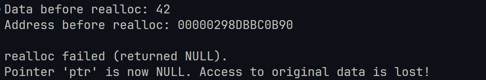
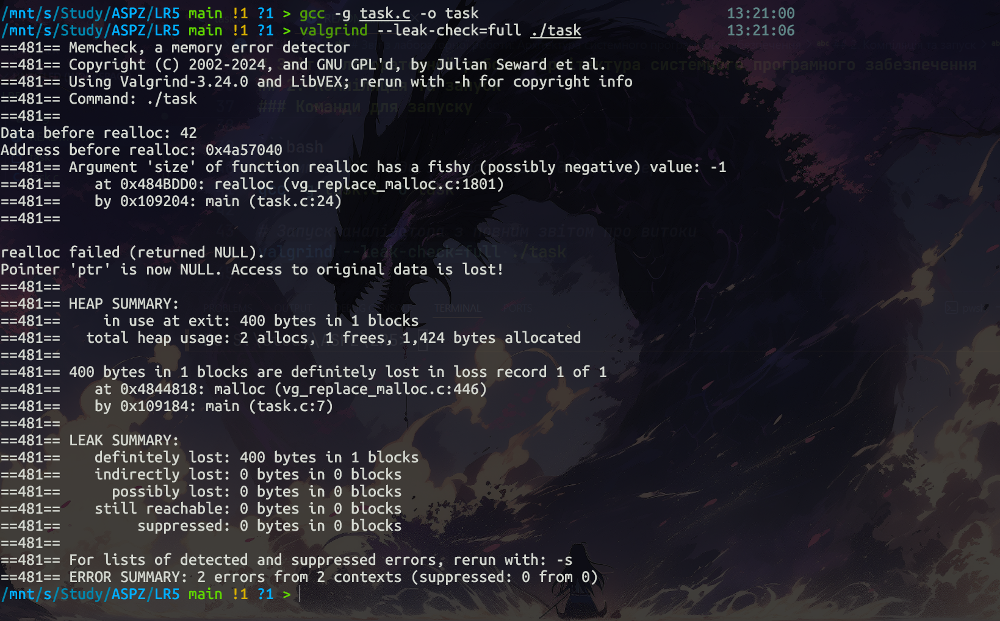

# Звіт з лабораторної роботи: Архітектура системного програмного забезпечення

**Варіант:** 8
**Завдання:** Реалізувати некоректний виклик `realloc`, що втрачає дані при невдалому розширенні буфера.

---

## 1. Теорія

У мовах C/C++ керування пам’яттю виконується вручну, що часто стає причиною багів у програмах. Однією з найпоширеніших проблем є витік пам’яті (**Memory Leak**), який виникає, коли виділена пам’ять не звільняється після її використання.

Функція `realloc(void *ptr, size_t size)` використовується для зміни розміру раніше виділеного блоку пам’яті.

* У разі успіху вона повертає вказівник на новий блок пам’яті (який може мати іншу адресу) і копіює туди старі дані.
* У разі невдачі (наприклад, через нестачу системної пам’яті) вона повертає `NULL`, але початковий блок пам’яті залишається незмінним і дійсним.

### Суть помилки (уразливість)

Дуже поширеним антипатерном є присвоєння результату `realloc` безпосередньо в той самий вказівник:

```c
ptr = realloc(ptr, new_size);
```

Якщо розширення пам’яті завершується невдачею, `realloc` повертає `NULL`, що миттєво перезаписує змінну `ptr`.

У цей момент адреса початкового блоку даних втрачається назавжди. Програма більше не може отримати доступ до старих даних, і ми не можемо передати цю адресу у функцію `free()`.

Це призводить до безповоротного витоку пам’яті.

---

## 2. Компіляція та запуск

Щоб продемонструвати та проаналізувати цю помилку, ми використовуємо компілятор GCC з увімкненими символами налагодження (`-g`) та інструмент Valgrind.

### Команди для запуску

```bash
# Компіляція коду з інформацією для дебагера
gcc -g task.c -o task

# Запуск аналізатора з повним звітом про витоки
valgrind --leak-check=full ./task
```

---

## 3. Результати виконання





### Аналіз результатів

* Програма успішно виділяє початковий блок пам’яті та виводить його адресу.
* Ми намагаємося змінити його розмір, використовуючи `SIZE_MAX`, що гарантовано призведе до помилки розширення.
* Вказівник стає `NULL`, доступ до даних втрачено.
* Звіт Valgrind чітко вказує в розділі **LEAK SUMMARY**, що байти пам’яті **definitely lost** (безповоротно втрачені).

Це відбувається тому, що програма завершила роботу без виклику `free()` для початкового блоку, і на момент завершення не існувало жодного дійсного вказівника на цю ділянку.

---

## 4. Як це виправити (правильна реалізація)

Щоб запобігти цій помилці, завжди потрібно використовувати тимчасовий вказівник при виклику `realloc`.

Це гарантує, що у разі невдалого перерозподілу пам’яті ми збережемо початковий вказівник і зможемо безпечно звільнити пам’ять або обробити помилку.

### Правильний патерн коду

```c
// Використовуємо тимчасовий вказівник
int *temp = realloc(ptr, new_size);

if (temp == NULL) {
    // realloc завершився помилкою, але старий вказівник 'ptr' все ще дійсний
    printf("Помилка розширення пам'яті, старі дані збережено.\n");
    free(ptr); // Безпечно звільняємо пам’ять, запобігаючи витоку
    return 1;
}

// Якщо розширення успішне, оновлюємо основний вказівник
ptr = temp;
```
