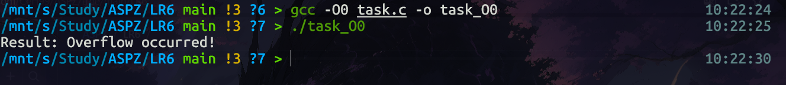
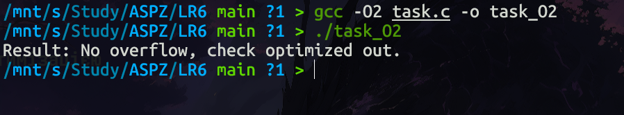
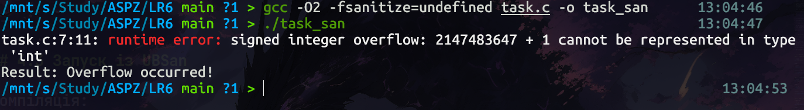

# LAB6

## Дослідження невизначеної поведінки (Undefined Behavior) та впливу оптимізацій компілятора

**Дисципліна:** Архітектура системного програмного забезпечення
**Варіант:** 8
**Тема:** Побудова прикладу Undefined Behavior, який демонструє різну поведінку програми при компіляції з `-O0` і `-O2`, а також аналіз впливу оптимізацій компілятора.

---

# 1. Мета роботи

Метою лабораторної роботи є:

* дослідити поняття невизначеної поведінки (Undefined Behavior) у мовах C/C++;
* створити приклад програми з UB;
* перевірити поведінку програми при різних рівнях оптимізації компілятора;
* дослідити роботу санітайзерів;
* навчитися правильно уникати подібних помилок.

---

# 2. Теоретичні відомості

## 2.1 Що таке Undefined Behavior

У мовах C та C++ стандартом визначено поняття **Undefined Behavior (UB)** — невизначена поведінка програми.

Це ситуація, коли код порушує правила стандарту, і компілятор більше не зобов’язаний гарантувати передбачуваний результат.

Наслідки UB можуть бути такими:

* програма працює «нормально»;
* програма завершується аварійно;
* з’являються випадкові помилки;
* логіка роботи змінюється після оптимізації;
* частина коду видаляється компілятором.

---

## 2.2 Приклади Undefined Behavior

До найбільш поширених випадків UB належать:

* переповнення знакового цілого типу;
* доступ за межі масиву;
* використання неініціалізованої пам’яті;
* розіменування `NULL`;
* подвійне звільнення пам’яті;
* використання висячих вказівників.

---

## 2.3 Signed Integer Overflow

У цій лабораторній роботі досліджується **переповнення знакового цілого числа**.

Наприклад:

```c
int x = INT_MAX;
x = x + 1;
```

На рівні процесора відбудеться переповнення, і число стане від’ємним.

Але згідно стандарту C:

> переповнення знакового цілого — це Undefined Behavior.

Тобто компілятор має право припустити, що така ситуація ніколи не трапляється.

---

## 2.4 Вплив оптимізації компілятора

Компілятори GCC / Clang при використанні оптимізацій (`-O1`, `-O2`, `-O3`) намагаються:

* видаляти зайвий код;
* спрощувати вирази;
* прибирати недосяжні гілки;
* покращувати швидкодію.

У разі UB компілятор може зробити небезпечні припущення.

Розглянемо умову:

```c
if (x + 1 < x)
```

З точки зору математики:

* число після додавання 1 завжди більше.

З точки зору компілятора:

* переповнення неможливе,
* тому умова завжди хибна,
* отже гілку `if` можна видалити.

Саме це і демонструється в лабораторній роботі.

---

# 3. Лістинг програми

## Пояснення роботи програми

Програма:

* бере максимальне значення типу `int`;
* додає до нього 1 в умові;
* перевіряє, чи стало число меншим;
* виводить результат.

Без оптимізації процесор виконає переповнення буквально.

З оптимізацією компілятор видалить перевірку.

---

# 4. Компіляція та запуск

## 4.1 Компіляція без оптимізації

```bash
gcc -O0 task.c -o task_O0
```

Запуск:

```bash
./task_O0
```

Скріншот результату:



---

## 4.2 Компіляція з оптимізацією

```bash
gcc -O2 task.c -o task_O2
```

Запуск:

```bash
./task_O2
```

Скріншот результату:



---

## 4.3 Запуск із UBSan

Компіляція:

```bash
gcc -O2 -fsanitize=undefined task.c -o task_san
```

Запуск:

```bash
./task_san
```

Скріншот:



---

# 5. Результати дослідження

## 5.1 Результат без оптимізації (`-O0`)

Очікуваний вивід:

```text
Result: Overflow occurred!
```

### Пояснення

Без оптимізації GCC виконує інструкції буквально:

* `INT_MAX = 2147483647`
* після `+1` отримуємо `-2147483648`
* умова стає істинною.

Тому виконується гілка `if`.

---

## 5.2 Результат з оптимізацією (`-O2`)

Очікуваний вивід:

```text
Result: No overflow, check optimized out.
```

### Пояснення

Оптимізатор припускає:

* UB неможливий;
* переповнення не станеться;
* вираз `x + 1 < x` завжди хибний.

Тому:

* умова видаляється;
* код спрощується;
* поведінка змінюється.

---

## 5.3 Результат із санітайзером

Очікуване повідомлення:

```text
runtime error: signed integer overflow
```

### Пояснення

UBSan:

* вставляє перевірки під час виконання;
* фіксує UB;
* повідомляє точне місце помилки.

Це дозволяє швидко знайти проблему.

---

# 6. Правильний спосіб уникнення переповнення

## 6.1 Безпечна реалізація

```c
#include <stdio.h>
#include <limits.h>

int safe_add_check(int x, int step) {
    if (x > INT_MAX - step) {
        return 1;
    }
    return 0;
}

int main() {
    int val = INT_MAX;
    int step = 1;

    if (safe_add_check(val, step)) {
        printf("Result: Blocked potential overflow!\n");
    } else {
        int y = val + step;
        printf("Result: Added safely.\n");
    }

    return 0;
}
```

---

## 6.2 Чому це правильно

У даному випадку:

* перевірка виконується ДО додавання;
* UB не виникає;
* код працює стабільно;
* оптимізація не змінює логіку.