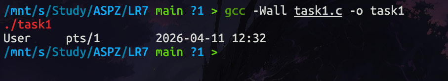
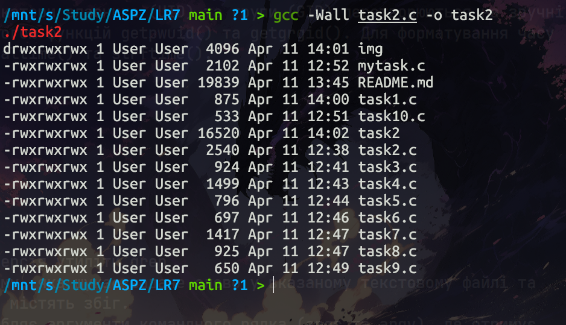
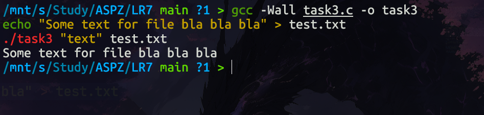
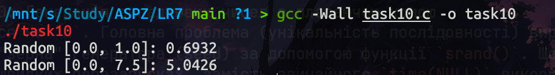
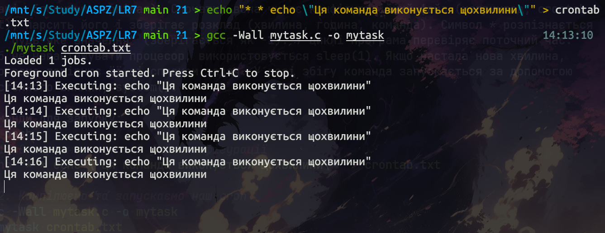

# Звіт з лабораторної роботи: Дослідження, моделювання та нестандартні підходи до аналізу процесів в Linux

## 1. Теоретичні відомості

Системне програмування в Linux охоплює розробку програм, які взаємодіють безпосередньо з ядром операційної системи, апаратними ресурсами та низькорівневими сервісами. 
Цей підхід виходить за межі використання високорівневих інструментів командного рядка (таких як `ps`, `top`, `cron`, `strace`).
Натомість він вимагає глибокого розуміння механізмів ядра, системних викликів (syscalls), файлових дескрипторів, прав доступу, планування процесів, керування пам’яттю та міжпроцесної взаємодії (IPC).

## 2. Аналоги стандартних утиліт UNIX, реалізовані в роботі

Під час виконання лабораторної роботи було створено власні спрощені реалізації наступних системних команд та утиліт:

* **`ls -l`**: Виводить список файлів у поточному каталозі разом із детальною інформацією (права доступу, кількість посилань, власник, група, розмір, час останньої модифікації). Для реалізації використовувались системні виклики `stat`, `opendir` та `readdir`.
* **`grep <слово>`**: Здійснює пошук заданого рядка або слова у вказаному текстовому файлі та виводить рядки, що містять збіги.
* **`more`**: Утиліта для посторінкового перегляду вмісту великих файлів. У нашій реалізації вивід зупиняється кожні 20 рядків і очікує натискання клавіші користувачем (через читання з `/dev/tty`).
* **`find .` / `ls -R`**: Виконує рекурсивний обхід поточного каталогу та всіх його підкаталогів для виведення повних шляхів до файлів.
* **`ls -d */` (з сортуванням)**: Виводить виключно підкаталоги поточної директорії, відсортовані за алфавітом (реалізовано за допомогою `scandir` та `alphasort`).
* **`chmod` (інтерактивний режим)**: Змінює права доступу до файлів. У лабораторній роботі утиліта інтерактивно запитує підтвердження на додавання прав читання для групи "others" (біт `S_IROTH`) до файлів з вихідним кодом `.c`.
* **`rm -i`**: Утиліта для видалення файлів (системний виклик `unlink`) з обов'язковим інтерактивним запитом на підтвердження кожної операції.
* **`time`**: Команда для вимірювання часу виконання програм або фрагментів коду. У роботі використано високоточні монотонні годинники (`clock_gettime(CLOCK_MONOTONIC)`).
* **`cron` (Foreground-реалізація)**: Планувальник задач. На відміну від стандартного `cron`, який працює як фоновий процес (демон), наша версія працює на передньому плані, щохвилини перевіряючи конфігураційний файл та запускаючи відповідні процеси через `system()`.


## 3. Практична реалізація завдань

### Завдання 1: Перенаправлення виводу (`rwho` до `more`)
**Проблема:** Необхідно передати вивід команди `rwho` на вхід команді `more` засобами мови C, уникаючи прямого делегування роботи системній оболонці (наприклад, не використовуючи `popen("rwho | more", "r")`).

**Рішення:** Створено програму, яка виступає посередником між двома процесами. Використано функцію `popen()` для відкриття процесу `rwho` на читання (потік `r`) та `more` на запис (потік `w`). Програма в циклі читає дані з першого потоку в буфер за допомогою `fgets()` і одразу записує їх у другий потік через `fputs()`, після чого коректно закриває обидва процеси через `pclose()`.

**Команди для запуску:**
```bash
gcc -Wall task1.c -o task1
./task1
```

Результат роботи:


### Завдання 2: Імітація команди ls -l
**Проблема:** Потрібно вивести список файлів поточного каталогу з їх детальними атрибутами (права доступу, кількість посилань, ім'я власника, група, розмір у байтах, час останньої модифікації), не викликаючи оригінальну системну утиліту ls.

**Рішення:** Для обходу каталогу використано системні виклики opendir() та readdir(). Метадані кожного знайденого файлу отримуються за допомогою виклику stat(). Права доступу формуються через побітове "І" (&) поля st_mode з відповідними масками (наприклад, S_IRUSR). Числові ідентифікатори власника (UID) та групи (GID) перетворюються на зручні для читання імена за допомогою функцій getpwuid() та getgrgid(). Для форматування часу використано комбінацію localtime() та strftime().

**Команди для запуску:**
```bash
gcc -Wall task2.c -o task2
./task2
```
Результат роботи:


**Завдання 3:** Спрощена версія утиліти grep
Проблема: Розробити програму, яка шукає задане слово у вказаному текстовому файлі та виводить лише ті рядки, що містять збіг.

**Рішення:** Програма обробляє аргументи командного рядка (argc та argv), де отримує шукане слово та ім'я цільового файлу. Файл відкривається через fopen(), після чого відбувається його порядкове читання за допомогою fgets(). Для пошуку цільового підрядка в кожному завантаженому рядку використовується функція стандартної бібліотеки strstr(). Якщо функція повертає вказівник (збіг знайдено), рядок виводиться у стандартний потік виводу.

**Команди для запуску:**
```bash
gcc -Wall task3.c -o task3
echo "Some text for file bla bla bla" > test.txt
./task3 "text" test.txt
```
Результат роботи:


### Завдання 4: Спрощена версія утиліти `more`
**Проблема:** Необхідно виводити вміст текстових файлів (переданих як аргументи) з автоматичною зупинкою кожні 20 рядків, очікуючи реакції користувача для продовження, подібно до системної утиліти `more`.

**Рішення:** Програма обробляє файли по черзі, читаючи їх через `fgets()` і ведучи лічильник виведених рядків. Головна системна особливість реалізації полягає у тому, що для очікування натискання клавіші програма читає не зі стандартного потоку введення (`stdin`), а безпосередньо з файлу термінала `/dev/tty`. Це гарантує коректну роботу паузи навіть у випадках, коли потік `stdin` було перенаправлено. Для візуалізації підказки використано ANSI escape-коди інверсії кольорів.

**Команди для запуску:**
```bash
gcc -Wall task4.c -o task4
./task4 task4.c
```
Результат роботи:


### Завдання 5: Рекурсивний обхід каталогів
**Проблема:** Написати програму, яка виводить повний список усіх файлів у поточному каталозі, а також заглиблюється в усі існуючі підкаталоги.

**Рішення:** Завдання вирішено за допомогою класичної рекурсивної функції. Використовуються виклики opendir() та readdir() для читання вмісту. Принципово важливим моментом є перевірка та ігнорування системних посилань . (поточний каталог) та .. (батьківський каталог), щоб уникнути нескінченного циклу. Для кожного знайденого елемента формується відносний шлях (через snprintf()). Якщо елемент є директорією (перевірка entry->d_type == DT_DIR), функція викликає саму себе з новим шляхом.

**Команди для запуску:**
```bash
gcc -Wall task5.c -o task5
./task5
```
Результат роботи:


### Завдання 6: Вивід підкаталогів в алфавітному порядку
**Проблема:** Потрібно перелічити виключно підкаталоги поточної директорії і обов'язково відсортувати їх за алфавітом.

**Рішення:** Замість ручного читання та реалізації алгоритмів сортування, використано потужну системну функцію POSIX scandir(). Вона автоматично сканує директорію, застосовує до неї користувацьку функцію-фільтр (яка відкидає звичайні файли та приховані директорії, залишаючи лише видимі папки) і сортує результат за допомогою вбудованої функції alphasort. Оскільки scandir() динамічно виділяє пам'ять під масив структур, після виведення результату реалізовано коректне звільнення пам'яті через free(), щоб уникнути витоків.

**Команди для запуску:**
```bash
gcc -Wall task6.c -o task6
./task6
```
Результат роботи:


### Завдання 7: Інтерактивна зміна прав доступу
**Проблема:** Необхідно знайти всі файли з вихідним кодом на C (`.c`), що належать поточному користувачу, та в інтерактивному режимі надати можливість увімкнути право на читання цих файлів для інших користувачів (група others).

**Рішення:** Програма читає поточний каталог і для кожного знайденого файлу отримує його метадані через `stat()`. Належність файлу перевіряється порівнянням `st_uid` з ідентифікатором користувача, який запустив програму (`getuid()`). Наявність розширення `.c` визначається за допомогою `strrchr()`. Якщо користувач підтверджує зміну (вводить 'y'), права оновлюються системним викликом `chmod()`, до поточних прав якого через побітове "АБО" (`|`) додається константа `S_IROTH` (Read for Others).

**Команди для запуску:**
```bash
gcc -Wall task7.c -o task7
./task7
```

Результат роботи:


### Завдання 8: Інтерактивне видалення файлів
**Проблема:** Реалізувати безпечне видалення файлів у поточному каталозі з обов'язковим попереднім запитом на підтвердження для кожного знайденого файлу (власний аналог команди rm -i *).

**Рішення:** Використовується цикл з readdir() для перебору вмісту директорії. Програма жорстко ігнорує поточний (.) та батьківський (..) каталоги, щоб уникнути їх випадкового пошкодження. Для кожного файлу виводиться системний запит у консоль. Якщо користувач дає згоду, файл безповоротно видаляється з файлової системи за допомогою системного виклику unlink().

Команди для запуску:
```bash
gcc -Wall task8.c -o task8
./task8
```
Результат роботи:


### Завдання 9: Вимірювання часу виконання
**Проблема:** Заміряти точний час виконання певного фрагмента коду (наприклад, довгого циклу) у мілісекундах.

**Рішення:** Використання стандартного time() не підходить для точних замірів, тому застосовано системний виклик clock_gettime() з прапорцем CLOCK_MONOTONIC. Це монотонний годинник, який не залежить від синхронізації часу в системі (наприклад, через NTP-сервери). Час фіксується у структуру timespec до та після виконання цільового коду, після чого математично обчислюється різниця, перетворюючи секунди (tv_sec) та наносекунди (tv_nsec) у мілісекунди (тип double).

Команди для запуску:
```bash
gcc -Wall task9.c -o task9
./task9
```

Результат роботи:


### Завдання 10: Генерація випадкових чисел з плаваючою комою
**Проблема:** Необхідно згенерувати послідовність випадкових чисел у діапазонах `[0.0, 1.0]` та `[0.0, n]`, причому гарантувати, що послідовність буде унікальною при кожному запуску (навіть якщо програма запускається кілька разів протягом однієї секунди).

**Рішення:** Для генерації базового дробового числа від 0 до 1 значення стандартної функції `rand()` ділиться на константу `RAND_MAX`. Для діапазону до `n` базове значення просто множиться на `n`. Головна проблема (унікальність послідовності) вирішується встановленням "зерна" генератора (seed) за допомогою функції `srand()`. Щоб уникнути повторень при швидких перезапусках, замість звичайного `time(NULL)` використовується побітове "ВИКЛЮЧНЕ АБО" (`XOR`) поточного часу та ідентифікатора процесу: `srand(time(NULL) ^ getpid())`.

**Команди для запуску:**
```bash
gcc -Wall task10.c -o task10
./task10
```
Результат роботи:


## Індивідуальне завдання (Варіант 8): Foreground Cron
**Проблема:** Реалізувати функціонал планувальника задач cron, який не використовує жодного фону або демонів, а працює безпосередньо у поточному терміналі.

**Рішення:** Написано програму, яка працює у нескінченному циклі while(1) (на передньому плані, блокуючи термінал). Спочатку вона читає конфігураційний файл (наприклад, crontab.txt), парсить його і зберігає розклад (хвилина, година, команда). Символ * розпізнається як "будь-яке значення" (зберігається як -1). У циклі програма перевіряє поточний час. Щоб не навантажувати процесор, використовується sleep(1). Якщо настала нова хвилина, програма порівнює її зі списком задач. У разі збігу команда запускається за допомогою системного виклику system().

Команди для запуску:
```bash
# 1. Створюємо тестовий файл конфігурації
echo "* * echo \"Ця команда виконується щохвилини\"" > crontab.txt

# 2. Компілюємо та запускаємо наш cron
gcc -Wall mytask.c -o mytask
./mytask crontab.txt
```
Результат роботи:
