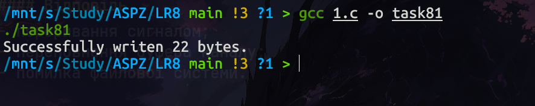
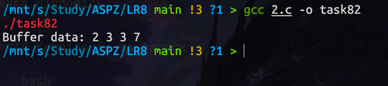
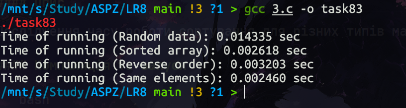
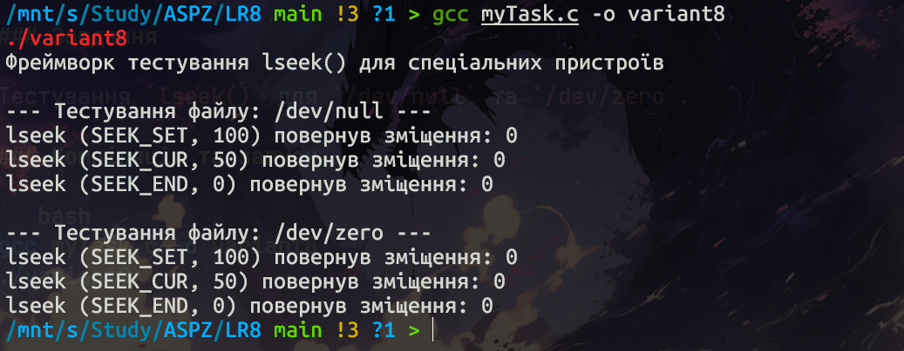

# Звіт до практичної роботи №8
## Тема: Системні виклики в UNIX/POSIX (файлові операції, процеси, сортування)

---

## 1. Теоретичні відомості

Системні виклики — це основний інтерфейс між прикладною програмою та ядром операційної системи.

У UNIX-подібних системах (POSIX) ключовими є такі виклики:

- **`write()` / `read()`** — низькорівневі операції введення-виведення для роботи з дескрипторами файлів;
- **`lseek()`** — зміна поточної позиції (курсора) у відкритому файлі;
- **`fork()`** — створення нового процесу шляхом дублювання поточного;
- **`qsort()`** — бібліотечна функція з `stdlib.h`, що реалізує швидке сортування.

### Основні особливості

### `write()`
Використовується для запису байтів у файл або інший дескриптор.

```c
ssize_t write(int fd, const void *buf, size_t count);
```

### `read()`
Зчитує байти з файлу або дескриптора.

```c
ssize_t read(int fd, void *buf, size_t count);
```

### `lseek()`
Переміщує файловий покажчик.

```c
off_t lseek(int fd, off_t offset, int whence);
```

### `fork()`
Створює дочірній процес. У дочірньому процесі повертає `0`, у батьківському — PID дочірнього процесу.

---

## 2. Загальні завдання

### Завдання 8.1 — Дослідження поведінки `write()`

#### Питання

Чи може виклик

```c
count = write(fd, buffer, nbytes);
```

повернути значення, відмінне від `nbytes`?

#### Відповідь

Так, може.

Основні причини:
- нестача місця на диску;
- переривання сигналом;
- переповнення буфера каналу;
- помилка файлової системи.

#### Компіляція та запуск

```bash
gcc 1.c -o task81
./task81
```

#### Скріншот виконання



#### Пояснення

Програма відкриває файл і записує рядок. Якщо `write()` не може записати всі байти, значення `count` буде меншим за `nbytes`.

---

### Завдання 8.2 — Робота з `lseek()` та `read()`

#### Умова

Файл містить:

```
4, 5, 2, 2, 3, 3, 7, 9, 1, 5
```

Виконується:

```c
lseek(fd, 3, SEEK_SET);
read(fd, &buffer, 4);
```

#### Відповідь

Після зміщення на 3 байти буфер міститиме:

```
2 3 3 7
```

#### Компіляція та запуск

```bash
gcc 2.c -o task82
./task82
```

#### Скріншот виконання



#### Пояснення

`lseek()` дозволяє довільно переміщатися по файлу без послідовного зчитування.

---

### Завдання 8.3 — Аналіз `qsort()`

#### Опис

Дослідження часу роботи сортування для різних типів масивів.

#### Компіляція та запуск

```bash
gcc 3.c -o task83
./task83
```

#### Скріншот виконання



#### Пояснення

Для деяких реалізацій `qsort()` вже відсортований масив може призводити до погіршення продуктивності до O(n²).

---

### Завдання 8.4 — Аналіз `fork()`

#### Питання

Яким буде результат виконання програми?

#### Відповідь

Буде виведено два числа:

- `0` — у дочірньому процесі
- `PID` — у батьківському

#### Компіляція та запуск

```bash
gcc 4.c -o task84
./task84
```

#### Скріншот виконання


#### Пояснення

Після `fork()` програма продовжує виконання у двох процесах одночасно.

---

## 3. Варіант №8

### Завдання

Тестування `lseek()` для `/dev/null` та `/dev/zero`.

### Компіляція та запуск

```bash
gcc myTask.c -o variant8
./variant8
```

### Скріншот виконання



### Пояснення

Це демонструє принцип UNIX:

> everything is a file

Навіть спеціальні пристрої підтримують файлові операції.

---

## 4. Висновок

У ході виконання практичної роботи було досліджено основні системні виклики POSIX:

- `write()`
- `read()`
- `lseek()`
- `fork()`

Також було проаналізовано поведінку функції `qsort()` та роботу зі спеціальними системними файлами.

Отримані результати підтверджують основні принципи роботи UNIX-подібних операційних систем.