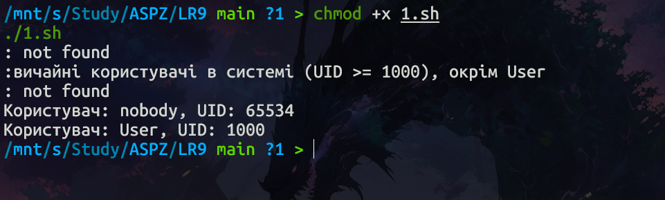
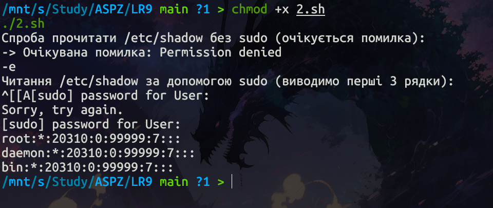
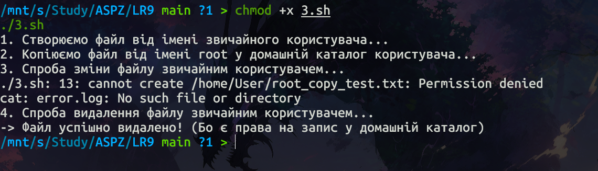
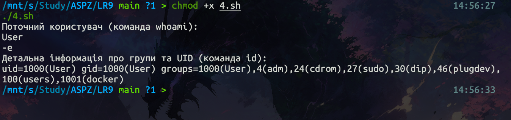
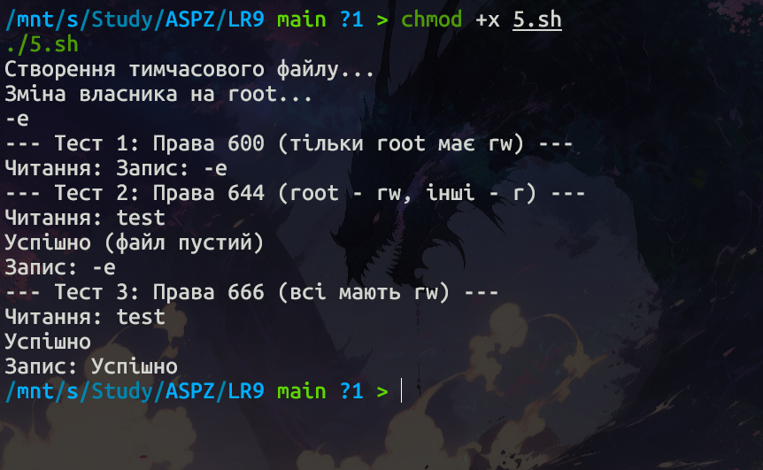
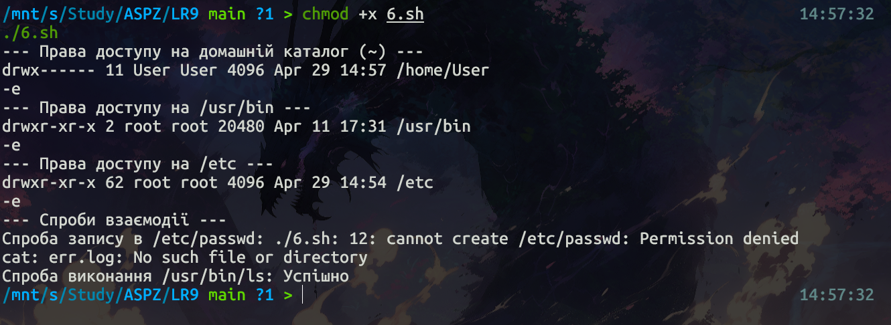
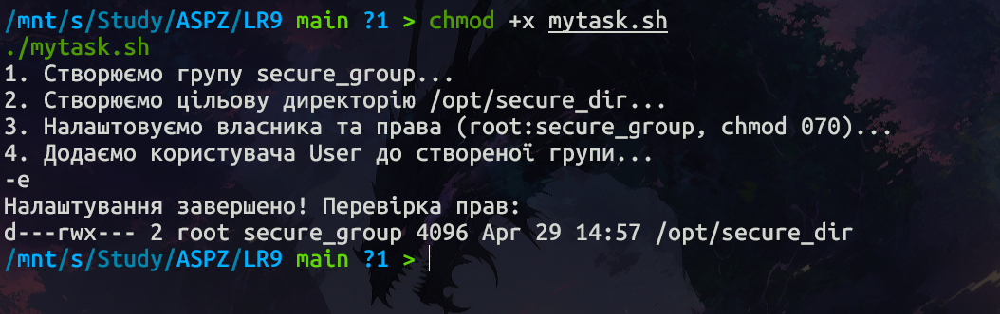

# Практична робота №9: Управління правами доступу в UNIX/Linux

---

## Теоретичні відомості

У UNIX/Linux-файлових системах, щоб запустити файл як програму або скрипт, необхідно, щоб були виставлені права на виконання (`x`). Однак існує виняток: якщо скрипт не має прав на виконання, але має права на читання, його можна передати як аргумент до інтерпретатора напряму (наприклад, `bash script.sh`).

У цьому випадку відбувається не запуск скрипта безпосередньо, а виклик інтерпретатора, який читає вміст файлу та виконує його. Таким чином, обхід прав на виконання — можливий. Права на виконання потрібні лише для прямого запуску скрипта (`./script.sh`).

Це часто використовується в:
- автоматизації;
- тестуванні безпеки для обходу обмежень;
- аналізі прав доступу.

---

## Загальні завдання

### Завдання 9.1: Пошук облікових записів

**Опис роботи:** Програма читає файл `/etc/passwd` за допомогою команди `getent passwd`, щоб дізнатись, які облікові записи визначені в системі. Відбувається пошук звичайних користувачів з UID більшим за 1000, окрім поточного користувача.

#### Команди компіляції та запуску

```bash
chmod +x 1.sh
./1.sh
```

#### Результат виконання



#### Пояснення

Скрипт використовує `getent passwd` для отримання списку користувачів та утиліту `awk` для фільтрації результатів. Утиліта відкидає системні акаунти (де UID < 1000) та поточного користувача, залишаючи лише цільові облікові записи.

---

### Завдання 9.2: Читання захищених файлів

**Опис роботи:** Програма виконує команду `cat /etc/shadow` від імені адміністратора, хоча запускається від звичайного користувача.

#### Команди компіляції та запуску

```bash
chmod +x 2.sh
./2.sh
```

#### Результат виконання



#### Пояснення

Звичайний користувач системи не має прав на читання файлу `/etc/shadow`. При звичайному виклику система відмовляє у доступі. Використання утиліти `sudo` дозволяє тимчасово підвищити привілеї та виконати команду від імені адміністратора (`root`), якщо це дозволено конфігурацією системи.

---

### Завдання 9.3: Маніпуляції з файлами та правами

**Опис роботи:** Програма від імені `root` копіює створений звичайним користувачем файл у його домашній каталог. Після цього звичайний користувач намагається змінити та видалити цей файл.

#### Команди компіляції та запуску

```bash
chmod +x 3.sh
./3.sh
```

#### Результат виконання



#### Пояснення

Оскільки файл скопійовано від імені `root`, саме `root` стає його власником. Через це звичайний користувач не може його змінити (отримує `Permission denied`). Проте користувач може видалити цей файл, оскільки право на видалення визначається правами доступу на директорію — в даному випадку домашній каталог користувача, де він має права на запис.

---

### Завдання 9.4: Перевірка стану облікового запису

**Опис роботи:** Програма по черзі виконує команди `whoami` та `id` для перевірки стану облікового запису та списку груп користувача.

#### Команди компіляції та запуску

```bash
chmod +x 4.sh
./4.sh
```

#### Результат виконання



#### Пояснення

Команда `whoami` повертає лише ім'я поточного ефективного користувача. Команда `id` є більш інформативною: вона показує не лише UID та GID, а й усі системні групи (наприклад, `sudo`, `docker`, `adm`), до яких належить цей користувач.

---

### Завдання 9.5: Зміна власника (`chown`) та прав (`chmod`)

**Опис роботи:** Створюється тимчасовий файл, після чого від імені суперкористувача змінюється його власник та права доступу. Програма тестує можливості читання та запису.

#### Команди компіляції та запуску

```bash
chmod +x 5.sh
./5.sh
```

#### Результат виконання



#### Пояснення

Коли власником файлу став `root`, звичайний користувач підпадає під категорію дозволів "інші" (`others`):

- **`600` (`rw-------`)** — доступу немає взагалі;
- **`644` (`rw-r--r--`)** — користувач може лише читати файл;
- **`666` (`rw-rw-rw-`)** — користувач отримує повний доступ до читання та запису.

---

### Завдання 9.6: Обхід прав доступу

**Опис роботи:** Перегляд власників та прав доступу в домашньому каталозі, в `/usr/bin` та в `/etc` за допомогою `ls -l`. Програма намагається обійти права та взаємодіяти з системними файлами.

#### Команди компіляції та запуску

```bash
chmod +x 6.sh
./6.sh
```

#### Результат виконання



#### Пояснення

У системних директоріях (наприклад, `/etc`) звичайний користувач має права лише на читання, тому система блокує спроби запису. У директорії `/usr/bin` лежать виконувані файли, які належать `root`, але мають права на виконання (`x`) для всіх користувачів, тому їх можна запускати.

---

## Варіант №8

### Завдання: Специфічний доступ до директорії через групи

**Опис роботи:** Створення групи користувачів, яка має повний доступ до окремої директорії, за умови, що жоден з учасників не має доступу до неї індивідуально.

#### Команди компіляції та запуску

```bash
chmod +x mytask.sh
./mytask.sh
```

#### Результат виконання



#### Пояснення

Для вирішення цього завдання було створено директорію `/opt/secure_dir` та нову групу `secure_group`. Ключовий момент — встановлення прав доступу за допомогою команди `chmod 070`:

- **Власник (`root`):** `0` — немає прав на рівні файлової системи (хоча `root` має абсолютний доступ);
- **Група (`secure_group`):** `7` — повний доступ: читання, запис, виконання/перехід у директорію;
- **Інші:** `0` — доступ заборонено.

Оскільки звичайний користувач потрапляє в категорію "інші", він отримує `Permission denied`. Проте, будучи доданим до групи `secure_group`, він отримує повний доступ виключно завдяки груповим привілеям. Таким чином, індивідуальний доступ повністю заблоковано.