## Завдання 4.1: Максимальний обсяг пам'яті для malloc(3)

Параметр `malloc(3)` має тип `size_t`. На 64-бітній Linux `size_t` — 8 байт, тобто теоретичний максимум — $2^{64}$ байт. Проте реальна межа — 8 ЕБ, а не 16: стандарт C вимагає, щоб різниця між вказівниками поміщалась у знаковий `ptrdiff_t` ($2^{63}-1$), а ОС ділить адресний простір навпіл між ядром і простором користувача.

**Файл з кодом:** `task4_1.c`

```bash
# x86_64
gcc 1.c -o task1_64 && ./task1_64

# x86
gcc -m32 1.c -o task1_32 && ./task1_32
```

**Результат:** в обох випадках `malloc` повертає `NULL` — ОС не може виділити такий блок. На x86 `size_t` — 4 байти, тому максимум ~4 ГБ, але і він недосяжний через резервацію простору ядром.

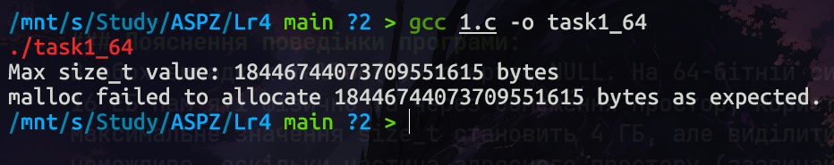
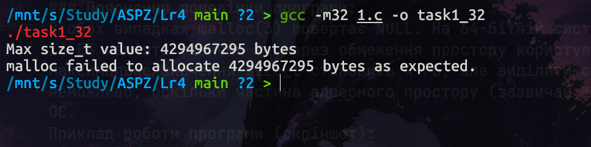

---

## Завдання 4.2: Від'ємний аргумент та переповнення

`malloc(3)` очікує `size_t` (беззнаковий тип). Якщо `num = xa * xb` оголошено як `int` і множення переповнюється — `num` стає від'ємним. При передачі у `malloc` він неявно перетворюється на величезне беззнакове число, яке ОС не може виділити.

```bash
gcc 2.c -o task2_64 && ./task2_64
gcc -m32 2.c -o task2_32 && ./task2_32
```

**Результат:** на обох архітектурах `malloc` повертає `NULL`. На x86_64 від'ємне `int` перетворюється в ~16 ЕБ, на x86 — в ~3-4 ГБ.

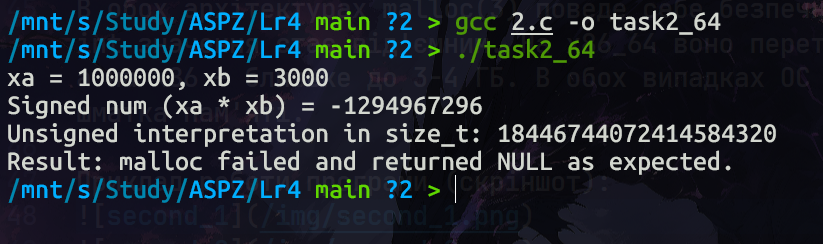
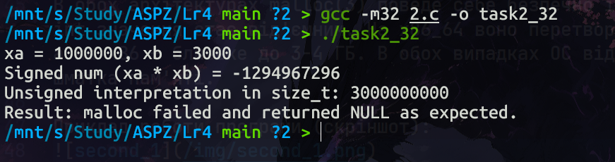

---

## Завдання 4.3: Виклик malloc(0)

Поведінка `malloc(0)` залежить від реалізації. У `glibc` повертається валідний вказівник на мінімальний блок (з метаданими), але записувати за ним нічого не можна. Вказівник обов'язково треба передати у `free()`.

```bash
gcc 3.c -o task3
ltrace ./task3
```

**Результат у ltrace:** видно виклик `malloc(0)`, який повертає адресу, після чого `free()` коректно її звільняє.

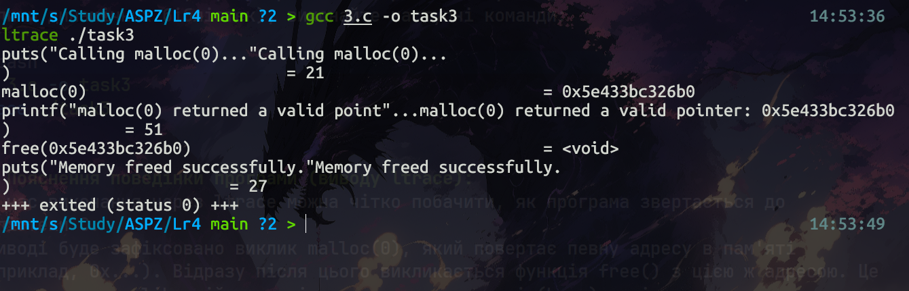

---

## Завдання 4.4: Помилки в циклі з malloc та free

```c
void *ptr = NULL;
while (<some-condition-is-true>) {
    if (!ptr)
        ptr = malloc(n);
    [... <використання 'ptr'> ...]
    free(ptr);
}
```

**Проблема:** після `free(ptr)` вказівник не занулюється. На наступній ітерації `if (!ptr)` — хибне, нова пам'ять не виділяється, програма звертається до звільненої пам'яті (use-after-free) і потім звільняє її вдруге (double free).

**Виправлення:** після `free(ptr)` додати `ptr = NULL;`.

```bash
gcc 4.c -o task4 && ./task4
```

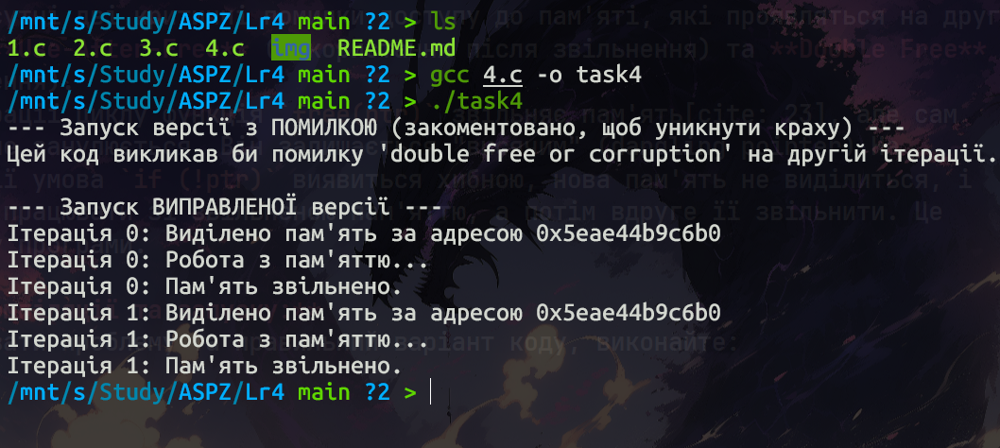
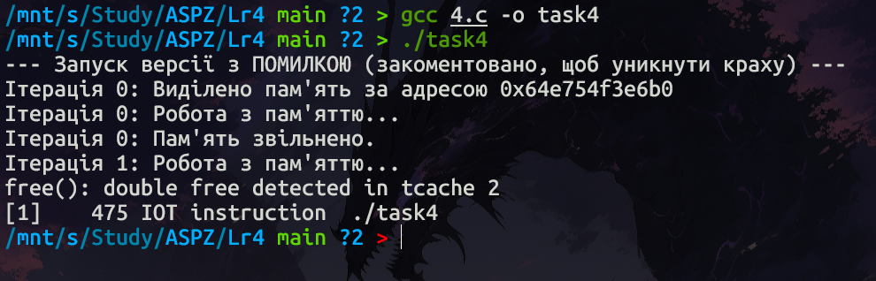

---

## Завдання 4.5: Поведінка realloc(3) при нестачі пам'яті

Якщо `realloc` не може виділити пам'ять — повертає `NULL`, але оригінальний блок залишається дійсним. Небезпечний патерн: `ptr = realloc(ptr, new_size)` — у разі помилки `ptr` стає `NULL` і вихідний блок втрачається (memory leak). Завжди писати результат у тимчасову змінну.

```bash
gcc 5.c -o task5 && ./task5
```

**Результат:** програма виділяє 1 КБ, потім намагається розширити до `SIZE_MAX`. `realloc` повертає `NULL`, оригінальний блок коректно звільняється через тимчасовий вказівник.

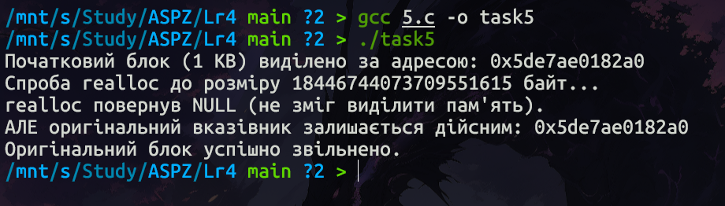

---

## Завдання 4.6: Поведінка realloc(3) з NULL та розміром 0

- `realloc(NULL, size)` ≡ `malloc(size)`
- `realloc(ptr, 0)` ≡ `free(ptr)`, повертає `NULL`

```bash
gcc 6.c -o task6 && ./task6
```

**Результат:** `realloc(NULL, 1024)` виділяє блок, `realloc(ptr, 0)` його звільняє.

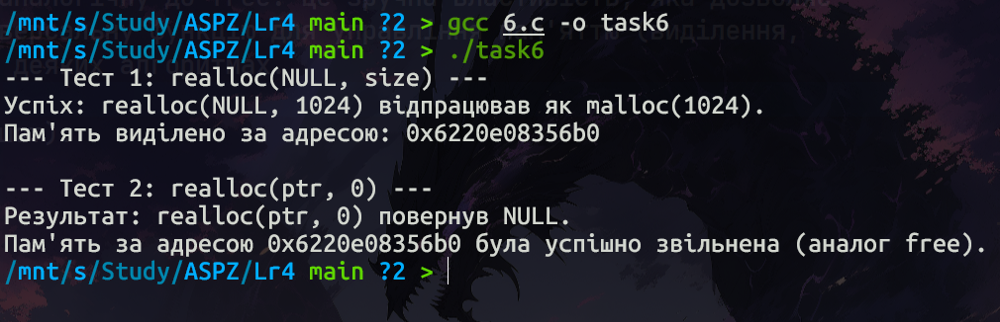

---

## Завдання 4.7: Використання reallocarray(3)

`realloc(ptr, 500 * sizeof(struct sbar))` — ризик цілочисельного переповнення при множенні. `reallocarray(ptr, nmemb, size)` виконує множення безпечно: при переповненні одразу повертає `NULL`.

```bash
gcc 7.c -o task7
ltrace ./task7
```

**ltrace:** при `realloc` видно вже перемножений результат (`realloc(0x..., 20000)`). При `reallocarray` — окремі аргументи (`reallocarray(0x..., 500, 40)`), перевірка переповнення всередині функції.

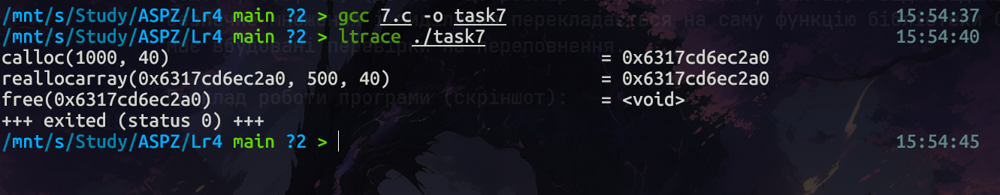

---

## Індивідуальне завдання: Порівняння calloc() та malloc()+memset() (Варіант 8)

`calloc` і `malloc+memset` дають однаковий результат, але працюють по-різному.

При великих блоках `glibc` використовує `mmap`. `calloc` лише налаштовує таблиці сторінок, відображаючи всі віртуальні сторінки на одну фізичну **zero-page** (read-only). Реальна фізична пам'ять виділяється лише при записі (page fault). Тому `calloc` повертається майже миттєво.

`malloc+memset` одразу записує в кожен байт, змушуючи ОС обробляти мільйони page fault і фізично заповнювати пам'ять нулями — в сотні разів повільніше.

```bash
gcc MyTask.c -o mytask && ./mytask
```

**Результат:** `calloc` — частки мілісекунди (~0.00001 с), `malloc+memset` — ~0.2–0.5 с на блоці 1 ГБ.

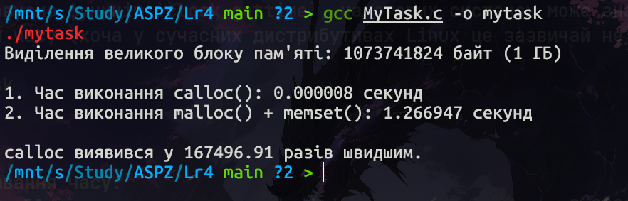