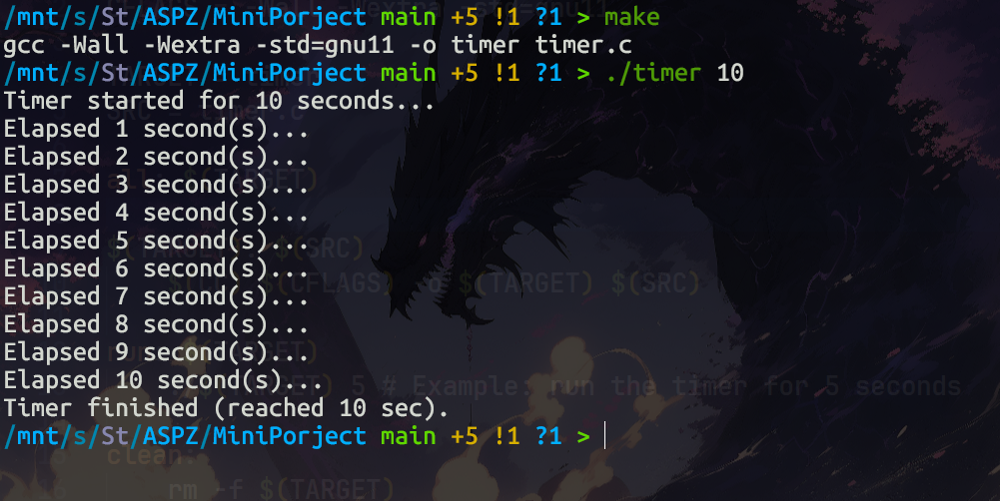

# Міні-проект: Розробка інтервального таймера

---

## Теоретичні відомості

У системах UNIX/Linux для роботи з часом та таймерами часто використовуються сигнали. Одним із найпоширеніших способів реалізації періодичних дій є використання інтервальних таймерів (`setitimer`).

Основні компоненти:
- **Сигнал `SIGALRM`**: надсилається процесу, коли спрацьовує таймер.
- **Системний виклик `setitimer`**: дозволяє встановити початкову затримку та інтервал повторення для таймера. Використовує типи таймерів, такі як `ITIMER_REAL` (рахує реальний час).
- **Структура `sigaction`**: забезпечує надійний спосіб встановлення обробників сигналів, що є кращою альтернативою застарілій функції `signal()`.
- **Системний виклик `pause()`**: призупиняє виконання процесу до отримання будь-якого сигналу, що дозволяє уникнути енергоємного очікування в циклі (busy-waiting).

---

## Завдання: Реалізація консольного таймера

**Опис роботи:** Програма реалізує консольний таймер, який відраховує задану користувачем кількість секунд. Програма використовує системні виклики для налаштування обробника сигналу `SIGALRM` та запуску інтервального таймера. Кожної секунди програма прокидається від виклику `pause()`, інкрементує лічильник та виводить поточний стан у консоль. Після досягнення цільового часу робота завершується.

### Команди компіляції та запуску

```bash
make
./timer 10
```

### Результат виконання



### Пояснення

Для вирішення завдання було використано `sigaction` для реєстрації обробника. Оскільки `printf` не є безпечною для виклику в обробнику сигналу (не є async-signal-safe), обробник лише змінює значення атомарної змінної `elapsed_seconds`. Основна логіка виводу та перевірки умови завершення виконується в головному циклі `main()`. Це гарантує стабільність програми та відсутність станів гонитви.
